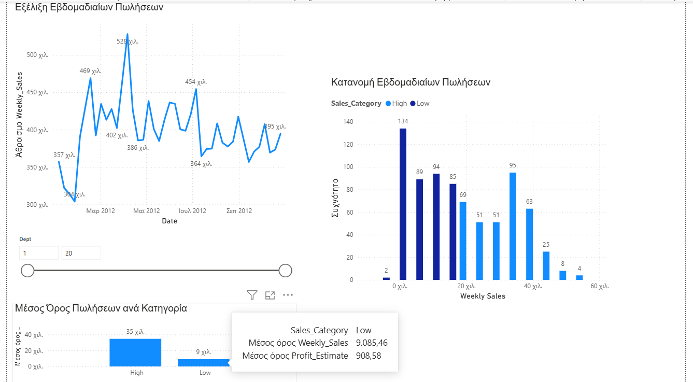

# Walmart Sales Data Analysis

## 🎯 Στόχος του Project
Σκοπός του project είναι η άντληση, ο καθαρισμός, ο εμπλουτισμός και η οπτικοποίηση δεδομένων πωλήσεων της Walmart.

## 🛠️ Εργαλεία που χρησιμοποιήθηκαν
* **MySQL:** Φιλτράρισμα δεδομένων (Επιλογή Καταστήματος, Τμημάτων, Έτους, ...).
* **Microsoft Excel:** Εμπλουτισμός δεδομένων με IF functions (Sales_Category, Profit_Estimate,...)
* **Power BI:** Οπτικοποίηση των αποτελεσμάτων

## 📂 Αρχεία στο Repository
* `ai_data_final_vlachou.sql`: Ο κώδικας δημιουργίας πίνακα, εισαγωγής δεδομένων και φιλτραρίσματος
* `Filtered_Walmart_Sales_Data_vlachou_final.xlsx`: Το τελικό αρχείο με τους υπολογισμούς
* `final_walmart_sales.png`: Power BI dashboard

## 📊 Οπτικοποίηση (Power BI Dashboard)
Το τελικό dashboard αναλύει τα δεδομένα πωλήσεων περιλαμβάνοντας:
* **Εξέλιξη Εβδομαδιαίων Πωλήσεων:** Line chart που αποτυπώνει το άθροισμα των πωλήσεων
* **Κατανομή Εβδομαδιαίων Πωλήσεων:** Ιστόγραμμα που δείχνει το πλήθος των πωλήσεων, διαχωρισμένο στις κατηγορίες High και Low
* **Μέσος Όρος Πωλήσεων ανά Κατηγορία:** Γράφημα ράβδων για τη σύγκριση των κατηγοριών High και Low
* **Extra** Slicer για την επιλογή συγκεκριμένων τμημάτων (Dept 1-20)

